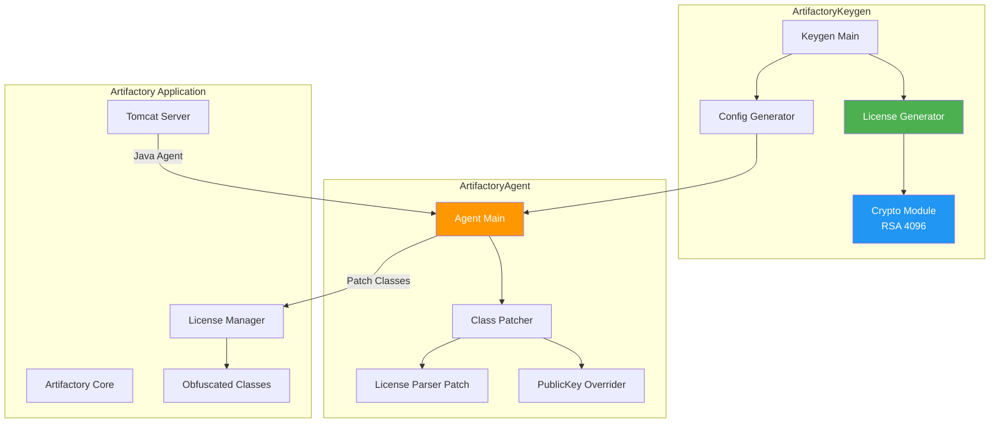
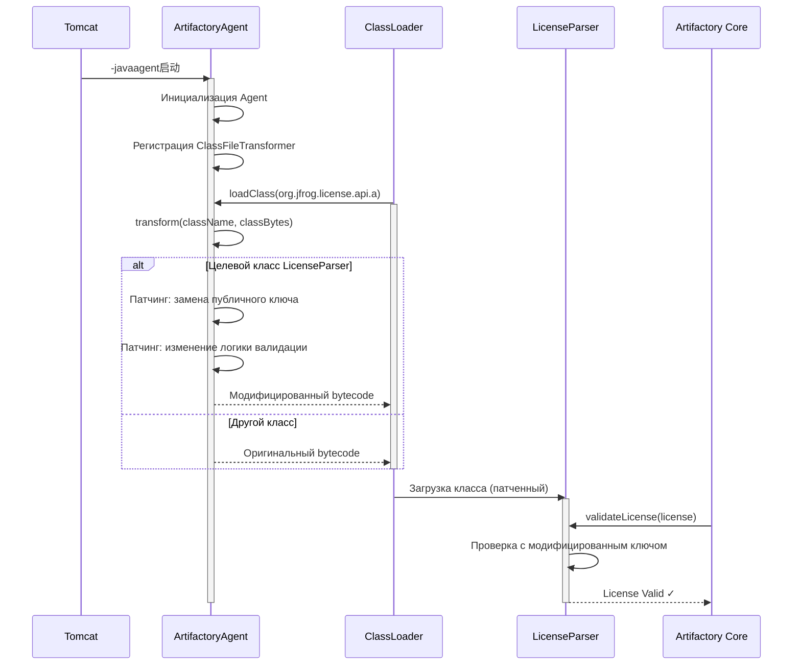
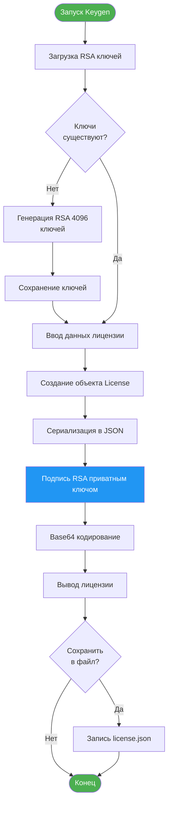
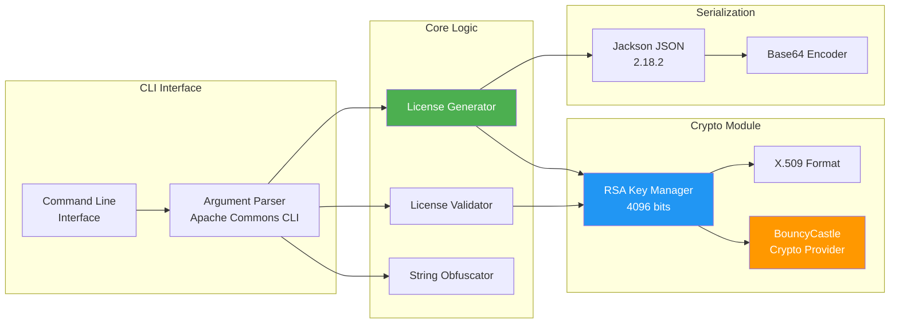
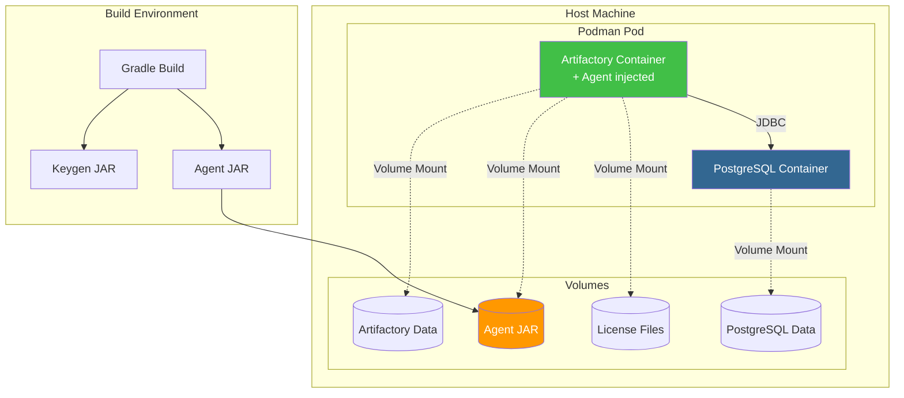

# ArtifactoryKeygen - Генератор ключей для JFrog Artifactory


[](https://996.icu)

> Образовательный проект для исследования механизмов лицензирования JFrog Artifactory

---

## Содержание

- [Описание проекта](#описание-проекта)
- [Важные предупреждения](#важные-предупреждения)
- [Архитектура системы](#архитектура-системы)
- [Требования](#требования)
- [Структура проекта](#структура-проекта)
- [Установка и сборка](#установка-и-сборка)
- [Использование](#использование)
  - [ArtifactoryKeygen](#artifactorykeygen)
  - [ArtifactoryAgent](#artifactoryagent)
- [Диаграммы и схемы](#диаграммы-и-схемы)
- [Конфигурация](#конфигурация)
- [Технические детали](#технические-детали)
- [Troubleshooting](#troubleshooting)
- [Roadmap](#roadmap)
- [Лицензия](#лицензия)

---

## Описание проекта

**ArtifactoryKeygen** - это образовательный проект университета по информационной безопасности и реверс-инжинирингу, демонстрирующий:

- Механизмы лицензирования enterprise-систем (JFrog Artifactory)
- Криптографические протоколы (RSA 4096, X.509)
- Техники reverse engineering Java-приложений
- Использование Java Agent для runtime модификации классов
- Работу с bytecode instrumentation

### Образовательные цели

1. **Информационная безопасность:** изучение методов защиты программного обеспечения
2. **Reverse Engineering:** анализ обфусцированного кода и восстановление алгоритмов
3. **Криптография:** практическое применение RSA, X.509, цифровых подписей
4. **Java Instrumentation:** модификация классов во время выполнения (Java Agent API)

### Компоненты проекта

| Компонент | Назначение | Технологии |
|-----------|------------|------------|
| **ArtifactoryKeygen** | Генерация лицензионных ключей | Kotlin, BouncyCastle, Jackson |
| **ArtifactoryAgent** | Java-агент для runtime патчинга | Java 25, Javassist |
| **Deployment** | Контейнеризация и развертывание | Podman, Containerfile |

**Тестировано на:**
- Artifactory 7.133.9 (целевая версия)
- Artifactory 7.104.6, 7.9.2, 7.125.10 (предыдущие 7.x)

---

## Важные предупреждения

### Юридическая ответственность

**ВНИМАНИЕ! ВЫ НЕ ДОЛЖНЫ ИСПОЛЬЗОВАТЬ ЭТОТ ПРОЕКТ ДЛЯ:**

- Незаконного обхода лицензий JFrog Artifactory
- Коммерческого использования без лицензии JFrog
- Нарушения законодательства вашей страны
- Любых нелегальных действий

**ВСЕ ПОСЛЕДСТВИЯ ИСПОЛЬЗОВАНИЯ ДАННОГО ПО НЕСЕТ ПОЛЬЗОВАТЕЛЬ**

### Образовательное использование

Проект создан **исключительно в образовательных целях**:
- Академические исследования в университете
- Изучение методов защиты ПО
- Практика reverse engineering
- Понимание механизмов криптографической защиты

### Лицензия

[](https://github.com/996icu/996.ICU/blob/master/LICENSE)

Проект распространяется под лицензией Anti-996, запрещающей использование в компаниях с режимом работы "996" (9:00-21:00, 6 дней в неделю).

---

## Архитектура системы



---

## Требования

### Системные требования

| Компонент | Минимум | Рекомендуется |
|-----------|---------|---------------|
| **RAM** | 2 GB | 4 GB+ |
| **CPU** | 2 cores | 4 cores+ |
| **Disk** | 5 GB | 10 GB+ |

### Программное обеспечение

#### Для сборки проекта

- **Java JDK:** 25+ (с поддержкой Project Loom, Virtual Threads)
- **Gradle:** 8.x (используется Gradle Wrapper)
- **Git:** для клонирования репозитория

#### Для запуска

- **Java Runtime:** 11+ (минимум)
- **Artifactory:** 7.x (OSS или Enterprise)

### Проверка версий

```bash
java -version
# openjdk version "25" 2025-09-16

./gradlew --version
# Gradle 8.x
# Kotlin: 2.1.20
# Groovy: 3.0.x
# JVM: 25
```

---

## Структура проекта

```
ArtifactoryKeygen/
├── src/                                 # Исходный код Keygen
│   └── main/
│       ├── kotlin/
│       │   └── icu/lama/artifactory/keygen/
│       │       └── Keygen.kt           # Главный класс генератора
│       └── java/
│           ├── org/jfrog/license/a/
│           │   └── ObfuscatedString.java  # Декомпилированный класс
│           └── org/jfrog/client/util/
│               └── ServicelistLoader.java
├── ArtifactoryAgent/                   # Java-агент для патчинга
│   ├── src/
│   │   └── main/java/icu/lama/artifactory/agent/
│   │       ├── AgentMain.java          # Entrypoint агента
│   │       ├── Constants.java          # Константы
│   │       └── patches/
│   │           ├── ClassPatch.java     # Базовый класс патчей
│   │           ├── PatcherLicenseParser.java
│   │           └── PublicKeyOverrider.java
│   └── build.gradle.kts
├── libs/                               # JFrog proprietary библиотеки
│   ├── artifactory-addons-manager-7.133.9.jar
│   └── README.MD
├── deployment/                         # Контейнеризация
│   ├── containerfiles/
│   │   ├── Containerfile.artifactory   # Podman/Docker image
│   │   └── Containerfile.keygen
│   └── podman-compose.yml
├── docs/                               # Документация
│   ├── BUILD-REPORT.md                 # Отчет о сборке
│   └── tmp/                            # Временная документация
├── JfrogDockerfile/                    # Примеры развертывания
│   ├── Cracked.Example.Dockerfile
│   ├── Example.docker-compose.yml
│   └── setenv.sh                       # Конфигурация Tomcat
├── build.gradle.kts                    # Gradle конфигурация
├── settings.gradle.kts
├── gradle.properties
├── CHANGELOG.md                        # История изменений
└── README.md                           # Этот файл
```

### Ключевые компоненты

- **`src/main/kotlin/`** - генератор лицензий (Kotlin)
- **`ArtifactoryAgent/`** - Java-агент для runtime патчинга
- **`libs/`** - проприетарные библиотеки JFrog (извлечены из artifactory.war)
- **`deployment/`** - Containerfile и podman-compose для развертывания
- **`docs/tmp/`** - техническая документация (не коммитится в Git)

---

## Установка и сборка

### Шаг 1: Клонирование репозитория

```bash
git clone https://github.com/dantte-lp/ArtifactoryKeygen.git
cd ArtifactoryKeygen
```

### Шаг 2: Извлечение JFrog библиотек

Проект использует проприетарную библиотеку JFrog, которую необходимо извлечь из `artifactory.war`.

#### 2.1. Скачать Artifactory

```bash
# Скачать Artifactory OSS
wget https://releases.jfrog.io/artifactory/artifactory-oss/org/artifactory/oss/jfrog-artifactory-oss/7.133.9/jfrog-artifactory-oss-7.133.9-linux.tar.gz

# Распаковать
tar -xzf jfrog-artifactory-oss-7.133.9-linux.tar.gz
```

#### 2.2. Извлечь библиотеку

```bash
# Перейти в директорию Tomcat
cd artifactory-oss-7.133.9/app/artifactory/tomcat/webapps/

# Распаковать WAR файл
unzip artifactory.war -d artifactory/

# Найти нужную библиотеку
find artifactory/WEB-INF/lib -name "artifactory-addons-manager*.jar"

# Скопировать в проект
cp artifactory/WEB-INF/lib/artifactory-addons-manager-7.133.9.jar \
   /path/to/ArtifactoryKeygen/libs/
```

#### 2.3. Проверить версию в build.gradle.kts

```kotlin
// В файле build.gradle.kts убедитесь, что версия совпадает
implementation(files("./libs/artifactory-addons-manager-7.133.9.jar"))
```

### Шаг 3: Сборка проекта

```bash
# Сборка ArtifactoryKeygen
./gradlew :shadowJar

# Сборка ArtifactoryAgent
./gradlew :ArtifactoryAgent:shadowJar

# Или собрать всё сразу
./gradlew clean build shadowJar
```

### Проверка результатов сборки

```bash
ls -lh build/libs/
# ArtifactoryKeygen-2.0-SNAPSHOT-all.jar

ls -lh ArtifactoryAgent/build/libs/
# ArtifactoryAgent-2.0-SNAPSHOT-all.jar
```

---

## Использование

### ArtifactoryKeygen

#### Генерация лицензии

```bash
java -jar build/libs/ArtifactoryKeygen-2.0-SNAPSHOT-all.jar gen
```

**Интерактивный режим:**

```
ArtifactoryKeygen v2.0-SNAPSHOT
Educational purposes only!

Enter License Type [Trial/Commercial/Enterprise]: Enterprise
Enter License Holder: My Company
Enter Email: admin@example.com
Enter Valid Days [default: 3650]: 365

Generating license...

===== LICENSE =====
{
  "licenseType": "Enterprise",
  "licensedTo": "My Company",
  "email": "admin@example.com",
  "validThrough": "2026-12-26",
  "signature": "..."
}

Save to file? [y/N]: y
License saved to: license.json
```

#### Просмотр текущего публичного ключа

```bash
java -jar build/libs/ArtifactoryKeygen-2.0-SNAPSHOT-all.jar pub
```

#### Генерация новой пары ключей

```bash
java -jar build/libs/ArtifactoryKeygen-2.0-SNAPSHOT-all.jar genkey
```

#### Проверка лицензии

```bash
java -jar build/libs/ArtifactoryKeygen-2.0-SNAPSHOT-all.jar verify license.json
```

#### Создание конфигурации для Agent

```bash
java -jar build/libs/ArtifactoryKeygen-2.0-SNAPSHOT-all.jar mkconfig
```

### Доступные команды

| Команда | Описание |
|---------|----------|
| `gen` | Сгенерировать лицензию |
| `pub` | Получить текущий публичный ключ (RSA) |
| `pri` | Получить текущий приватный ключ (RSA) |
| `genkey` | Сгенерировать новую пару ключей (RSA 4096) |
| `verify <license>` | Проверить лицензию текущим публичным ключом |
| `obf <text>` | Обфусцировать текст используя класс JFrog 'ObfuscatedString' |
| `mkconfig` | Создать конфигурацию для ArtifactoryAgent |
| `verifyAgent` | Проверить работу Agent (attach к текущему процессу) |
| `help` | Показать справку по командам |

---

### ArtifactoryAgent

#### Установка Agent в Artifactory

**1. Скопировать JAR файл**

```bash
# Скопировать Agent в директорию Artifactory
cp ArtifactoryAgent/build/libs/ArtifactoryAgent-2.0-SNAPSHOT-all.jar \
   /opt/jfrog/artifactory/app/artifactory/tomcat/lib/
```

**2. Настроить Tomcat для использования Agent**

Отредактировать файл `setenv.sh` (Linux/macOS) или `setenv.bat` (Windows):

**Linux / macOS:**

```bash
# /opt/jfrog/artifactory/app/artifactory/tomcat/bin/setenv.sh

# Добавить в конец файла:
CATALINA_OPTS="$CATALINA_OPTS -javaagent:/opt/jfrog/artifactory/app/artifactory/tomcat/lib/ArtifactoryAgent-2.0-SNAPSHOT-all.jar"
CATALINA_OPTS="$CATALINA_OPTS -Djf.product.home=/opt/jfrog/artifactory"

export CATALINA_OPTS
```

**Windows:**

```batch
REM setenv.bat

SET CATALINA_OPTS=%CATALINA_OPTS% -javaagent:C:\jfrog\artifactory\tomcat\lib\ArtifactoryAgent-2.0-SNAPSHOT-all.jar
SET CATALINA_OPTS=%CATALINA_OPTS% -Djf.product.home=C:\jfrog\artifactory
```

**3. Перезапустить Artifactory**

```bash
# Остановить
/opt/jfrog/artifactory/app/bin/artifactoryctl stop

# Запустить
/opt/jfrog/artifactory/app/bin/artifactoryctl start

# Проверить логи
tail -f /opt/jfrog/artifactory/var/log/console.log
```

#### Проверка работы Agent

```bash
# В логах Artifactory должно появиться:
[ArtifactoryAgent] Agent loaded successfully
[ArtifactoryAgent] Patching class: org.jfrog.license.api.a
[ArtifactoryAgent] License parser patched successfully
```

---

## Диаграммы и схемы

### Sequence Diagram: Процесс работы Agent



### Flowchart: Генерация лицензии



### Component Diagram: Структура Keygen



### Deployment Diagram: Развертывание с Podman



---

## Конфигурация

### Конфигурация Agent

#### Метод 1: Через Keygen (рекомендуется)

```bash
java -jar build/libs/ArtifactoryKeygen-2.0-SNAPSHOT-all.jar mkconfig
```

Вывод:
```
Enter your RSA Public Key (X.509 format):
[Paste your public key here]

Generated Agent Configuration:
3C636F6E6669673E0A202020203C7075626C69634B65793E594F55525F5055424C49435F4B45593C2F7075626C69634B65793E0A3C2F636F6E6669673E

Add to setenv.sh:
CATALINA_OPTS="$CATALINA_OPTS -javaagent:/path/to/agent.jar=3C636F6E6669673E..."
```

#### Метод 2: Вручную

1. Создать XML конфигурацию:

```xml
<config>
    <publicKey>YOUR_PUBLIC_KEY_HERE</publicKey>
</config>
```

2. Закодировать в Base64:

```bash
echo '<config><publicKey>...</publicKey></config>' | base64
```

3. Преобразовать в HEX (uppercase):

```bash
echo -n '<config>...</config>' | xxd -p | tr -d '\n' | tr '[:lower:]' '[:upper:]'
```

4. Передать в Agent:

```bash
CATALINA_OPTS="-javaagent:/path/to/agent.jar=<HEX_CONFIG>"
```

### Переопределение публичного ключа

Требования к публичному ключу:
- **Формат:** RSA Public Key в X.509
- **Размер:** минимум 4096 bits modulus
- **Кодировка:** PEM или DER

Генерация собственной пары ключей:

```bash
java -jar build/libs/ArtifactoryKeygen-2.0-SNAPSHOT-all.jar genkey

# Сохранит:
# - private-key.pem
# - public-key.pem
```

---

## Технические детали

### Технологии и библиотеки

#### ArtifactoryKeygen

| Технология | Версия | Назначение |
|------------|--------|------------|
| **Kotlin** | 2.1.20 | Основной язык |
| **Java** | 25 | JVM Target: 23 |
| **Gradle** | 8.x | Система сборки |
| **BouncyCastle** | 1.79 | Криптография (RSA, X.509) |
| **Jackson** | 2.18.2 | JSON сериализация |
| **Apache Commons CLI** | 1.9.0 | Парсинг аргументов CLI |
| **Apache Commons Codec** | 1.17.1 | Base64, Hex encoding |
| **ShadowJar** | 9.0.0-beta4 | Fat JAR packaging |

#### ArtifactoryAgent

| Технология | Версия | Назначение |
|------------|--------|------------|
| **Java** | 25 | Основной язык |
| **Javassist** | 3.30.2-GA | Bytecode manipulation |
| **Java Instrumentation API** | Built-in | Agent framework |

### Криптография

**Алгоритм:** RSA

**Параметры:**
- Key Size: 4096 bits
- Public Exponent: 65537 (0x10001)
- Signature Algorithm: SHA256withRSA
- Key Format: X.509 (SubjectPublicKeyInfo)

**Пример генерации ключа (BouncyCastle):**

```kotlin
val keyPairGenerator = KeyPairGenerator.getInstance("RSA", "BC")
keyPairGenerator.initialize(4096, SecureRandom())
val keyPair = keyPairGenerator.generateKeyPair()

val publicKey = keyPair.public as RSAPublicKey
val privateKey = keyPair.private as RSAPrivateKey
```

### Java Agent API

**Механизм работы:**

1. **premain method:** вызывается JVM до загрузки main класса
2. **ClassFileTransformer:** перехват загрузки классов
3. **Bytecode manipulation:** модификация bytecode с помощью Javassist
4. **Class redefinition:** загрузка модифицированного класса

**Пример Agent entrypoint:**

```java
public class AgentMain {
    public static void premain(String agentArgs, Instrumentation inst) {
        inst.addTransformer(new ClassFileTransformer() {
            @Override
            public byte[] transform(...) {
                // Patch bytecode here
            }
        });
    }
}
```

### Обфускация JFrog

JFrog использует обфускацию имен классов и методов:

- `org.jfrog.license.api.a` - обфусцированный класс LicenseParser
- Проприетарный алгоритм обфускации строк (`ObfuscatedString`)
- ProGuard/R8 для минификации

---

## Troubleshooting

### Проблема: Ошибка сборки - библиотека не найдена

**Симптомы:**
```
Could not resolve: artifactory-addons-manager-7.133.9.jar
```

**Решение:**
1. Убедитесь, что JAR файл находится в `libs/`
2. Проверьте версию в `build.gradle.kts`
3. Перезапустите Gradle daemon: `./gradlew --stop`

### Проблема: Agent не загружается

**Симптомы:**
```
Error occurred during initialization of VM
agent library failed to init: instrument
```

**Решение:**

1. Проверить путь к JAR в `setenv.sh`:
```bash
ls -la /opt/jfrog/artifactory/app/artifactory/tomcat/lib/ArtifactoryAgent-*.jar
```

2. Проверить права доступа:
```bash
chmod 644 /path/to/ArtifactoryAgent-*.jar
```

3. Проверить Java версию:
```bash
java -version
# Должна быть 11+
```

### Проблема: Лицензия не принимается

**Симптомы:**
```
License validation failed: Invalid signature
```

**Решение:**

1. Убедитесь, что Agent корректно загружен (проверьте логи)
2. Проверьте, что публичный ключ в конфигурации Agent совпадает с ключом, использованным для генерации лицензии
3. Используйте команду `verify` для проверки лицензии:
```bash
java -jar build/libs/ArtifactoryKeygen-2.0-SNAPSHOT-all.jar verify license.json
```

### Проблема: Gradle build fails на Java 25

**Симптомы:**
```
Unsupported class file major version 69
```

**Решение:**

Обновить `gradle/wrapper/gradle-wrapper.properties`:
```properties
distributionUrl=https\://services.gradle.org/distributions/gradle-8.12-bin.zip
```

### Проблема: BouncyCastle provider не найден

**Симптомы:**
```
java.security.NoSuchProviderException: BC
```

**Решение:**

Добавить BouncyCastle в classpath и зарегистрировать provider:

```kotlin
import org.bouncycastle.jce.provider.BouncyCastleProvider
import java.security.Security

Security.addProvider(BouncyCastleProvider())
```

---

## Roadmap

### Планируется в будущих версиях

- [ ] **Code Cleanup** - рефакторинг и улучшение структуры кода
- [ ] **Больше конфигурационных опций** для Keygen и Agent
- [ ] **Автоопределение версии Artifactory** при работе Agent
- [ ] **Миграция на LicenseManager** - использование де-обфусцированной версии `artifactory-addons-manager`
- [ ] **GUI версия Keygen** - графический интерфейс для упрощения использования
- [ ] **Интеграция тестов** - unit и integration тесты
- [ ] **CI/CD pipeline** - автоматизация сборки и релизов
- [ ] **Документация API** - Javadoc/KDoc для всех классов

### Текущие ограничения

- Работает только с Artifactory 7.x (целевая версия 7.133.9; протестировано 7.9.2 - 7.133.9)
- Требуется ручное извлечение JFrog библиотек
- Нет автоматической установки Agent
- Ограниченная поддержка кастомных конфигураций

---

## Сборка Docker/Podman образов

### Сборка Keygen образа

```bash
cd deployment/containerfiles

podman build -t artifactory-keygen:2.0 -f Containerfile.keygen ../..

# Запуск
podman run -it --rm artifactory-keygen:2.0 gen
```

### Сборка Artifactory с Agent

```bash
podman build -t artifactory-cracked:7.133.9 -f Containerfile.artifactory ../..

# Запуск через podman-compose
cd deployment
podman-compose up -d
```

---

## Вклад в проект

Pull Requests приветствуются!

### Как внести вклад

1. Fork репозитория
2. Создать feature branch: `git checkout -b feature/amazing-feature`
3. Commit изменений: `git commit -m 'Add amazing feature'`
4. Push в branch: `git push origin feature/amazing-feature`
5. Открыть Pull Request

### Требования к PR

- Код должен следовать Kotlin/Java code style
- Добавить тесты для новой функциональности
- Обновить документацию при необходимости
- Соблюдать образовательные цели проекта

---

## Лицензия

### Anti-996 License

[](https://github.com/996icu/996.ICU/blob/master/LICENSE)

Данный проект распространяется под лицензией Anti-996, которая запрещает:
- Использование в компаниях с режимом работы "996" (9:00-21:00, 6 дней в неделю)
- Коммерческое использование без соблюдения прав работников

### Образовательная лицензия

Проект создан **исключительно в образовательных целях**:

**Разрешено:**
- Использование в академических исследованиях
- Изучение кода для образовательных целей
- Использование в тестовых/лабораторных средах
- Форк и модификация для обучения

**Запрещено:**
- Коммерческое использование без легальной лицензии JFrog
- Нарушение Terms of Service JFrog Artifactory
- Использование в production без покупки лицензии
- Распространение для нелегальных целей

---

## Поддержка и контакты

### Получение помощи

1. Проверьте раздел [Troubleshooting](#troubleshooting)
2. Изучите документацию в `/docs/`
3. Просмотрите существующие Issues на GitHub
4. Создайте новый Issue с детальным описанием проблемы

### Связь

- **GitHub Repository:** [https://github.com/dantte-lp/ArtifactoryKeygen](https://github.com/dantte-lp/ArtifactoryKeygen)
- **Issues:** [GitHub Issues](https://github.com/dantte-lp/ArtifactoryKeygen/issues)
- **Original Author:** [@lama](https://github.com/yourusername)
- **University Project:** Educational Research

---

## Благодарности

- **JFrog** за создание отличной системы управления артефактами
- **BouncyCastle** за криптографическую библиотеку
- **Kotlin Team** за современный язык программирования
- **Open Source Community** за инструменты и библиотеки
- **996.ICU Movement** за борьбу за права работников

---

## Юридическая информация

### Disclaimer

Этот проект создан **исключительно в образовательных целях** в рамках университетской программы по информационной безопасности.

**Авторы и контрибьюторы:**
- НЕ несут ответственности за использование данного ПО
- НЕ поддерживают незаконное использование программного обеспечения
- НЕ призывают к нарушению лицензионных соглашений

**Пользователи:**
- Несут полную ответственность за использование данного ПО
- Обязаны соблюдать законодательство своей страны
- Должны приобретать легальные лицензии для production использования

### Авторские права

- **JFrog Artifactory** - торговая марка JFrog Ltd.
- **Данный проект** - не аффилирован с JFrog Ltd.
- **Код проекта** - распространяется под Anti-996 License

---

<div align="center">

**Создано:** 2024-2025
**Версия:** 2.0-SNAPSHOT
**Статус:** Active Educational Project


**Помните: используйте этот проект только в образовательных целях!**

</div>
